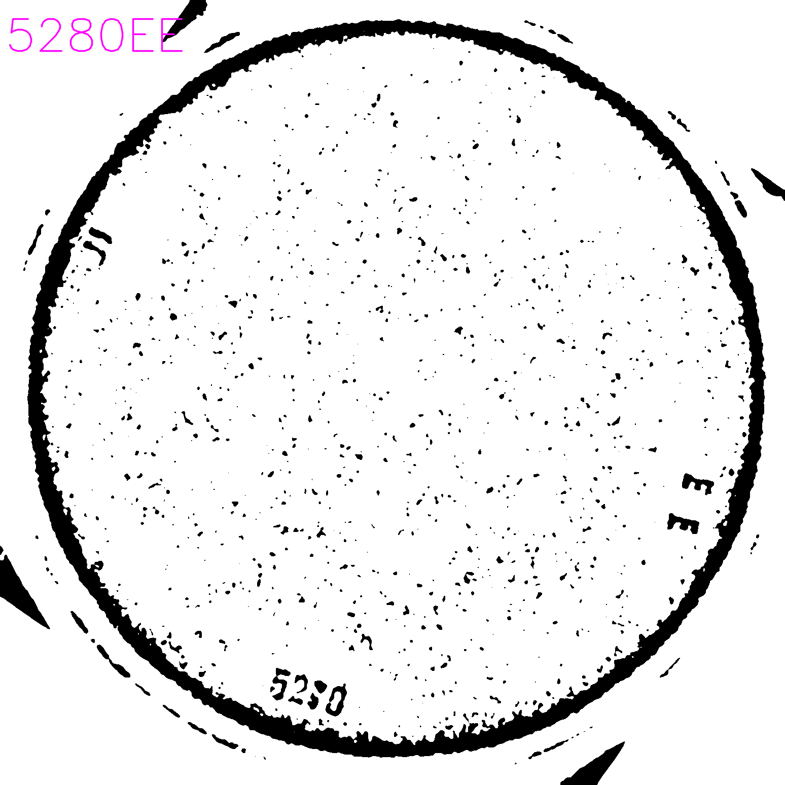

### TEXT EXTRACTION USING OPENCV AND GOOGLE VISION OCR

Simple script intended for demonstration purposes during the presentation of the dissertation paper

### Requirements

1. You need to have a Google Console Project and to enable the Google Vision OCR API
2. The application also requires a service account on GCP. You can see how to create one [here](https://cloud.google.com/iam/docs/creating-managing-service-accounts)
3. After the creation of the service account, a credential file must be downloaded and saved in the application's credentials folder located at `./data/credentials/vision`
4. Install [virtualenv](https://virtualenv.pypa.io/en/latest/installation/)
5. Python3.6 is required on your OS

### Installation instructions
1. `git clone git@github.com:Lucian-Olariu/text_extraction.git`
2. `cd text_extraction`
3. `virtualenv --python=python3.6 --no-site-packages venv`
4. `source venv/bin/activate`
5. `pip install -r requirements.txt`

### Exmaple input image 

### Exmaple output image
